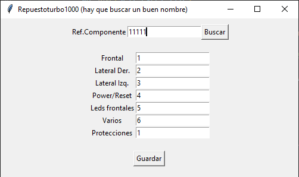

Programa gráfico en Python que interactúa con un archivo Excel para mostrar y modificar datos. Ha sido realizado utilizando la biblioteca tkinter para la interfaz gráfica y openpyxl para manejar archivos Excel. Este programa te permitirá ingresar una referencia, ver los datos asociados a esa referencia y modificarlos.

Este programa hace lo siguiente:
1. Crea una interfaz gráfica con tkinter.
2. Utiliza openpyxl para manejar el archivo Excel.
3. Permite ingresar una referencia y buscar los datos asociados.
4. Muestra los datos encontrados en campos de entrada editables.
5. Permite modificar los datos y guardarlos de vuelta en el archivo Excel.

6. Para usar este programa, necesitarás instalar las bibliotecas necesarias.
      tkinter
      openpyxl

   Cuando ejecutes el programa, se creará un archivo Excel llamado "Repuestos2024" en el mismo directorio si no existe. Puedes modificar el nombre del archivo en la línea `self.excel_file = "Repuestos2024"` si lo deseas.

Este es un programa que puede requerir ajustes según tus necesidades específicas, como manejar más campos, validar entradas, o mejorar el diseño de la interfaz. Muy facil de manejar y cambiar datos a necesidad de cada usuario.

   
   Para mas informacion contacten con creador.
